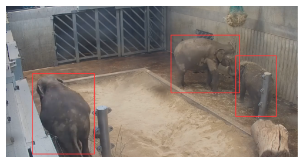
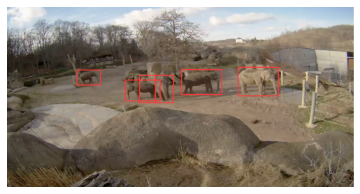

# Souhrn

### Sběr dat z živých streamů
https://www.zoopraha.cz/multimedia/prenos-z-udoli-slonu-zive?cam=6&res=l&start=6

#### Období sběru dat

- **Začátek sběru dat:** 21.01.2023
- **Konec sběru dat:** 22.03.2023

#### Intervaly sběru dat
Po celé období sběru dat byl pravidelně scrapován jeden frame ze všech 8 kamer.
- **Intervaly sběru dat:** každých 15 minut (mezi 13.02. a 27.02. každých 5 minut)

#### Celkový počet dat

Dohromady bylo sesbíráno přes **55 000** snímků z kamer. Z toho kolem **40 000** je skutečný záběr z výběhu slonů. Zbytek snímků jsou černé framy s varovnou hláškou, že je kamera nedostupná.

### Anotace dat

S pomocí předtrénovaných modelů probíhala poloautomatická anotace snímků. Model označil označil velké množství slonů. Následovala ruční korekce s pomocí nástroje `Coco Annotator`

- **Počet anotovaných snímků:** 7507
- **Počet anotovaných snímků s alespoň jedním slonem:** 5507
- **Počet slonů napříc všemi snímky:** 11433

### Výsledky modelu

S pomocí anotovaných dat bylo natrénováno několik modelů, ze kterých byl vybrán ten nejlepší na základě `Mean Average Precision` metriky.

Tento nejlepší model byl otestován na testovacím datasetu, které "nikdy neviděl".

- **Počet slonů v testovacím datasetu:** 1894
- **Počet slonů, které model neodhalil:** 47 (2.4 %)
- **Počet objektů, které zaměnil za slona:** 65

   

